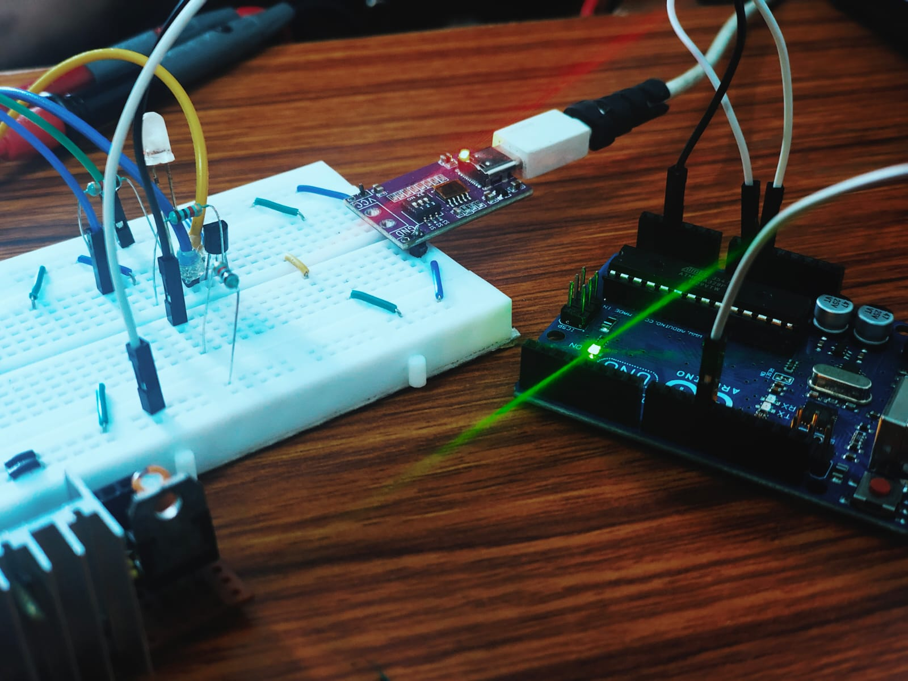

# 🔥 Fire Alarm using Single Diode (Arduino)

A simple fire alarm built using an Arduino and **a single diode**.
This project focuses on **core analog signal detection and timing logic**
instead of using ready-made fire sensors.

---

## 🚀 Overview

- The diode output is monitored using Arduino ADC
- When voltage rises above a threshold → alarm starts **immediately**
- When voltage returns to normal → alarm stops after **3 seconds**
- Logic is fully **non-blocking** using `millis()`

This is the **base version** of the project.  
Future updates may include sensors, signal conditioning, and improvements.

---

## ✨ Features

- 🔌 Single diode fire detection
- 📊 Analog voltage threshold monitoring
- 🔊 Immediate alarm trigger
- ⏱️ 3-second delayed stop
- 🧠 Non-blocking logic (no `delay()`)
- ⚙️ Built from scratch (no fire sensor module)

---

## 🧩 Hardware Used

- Arduino (Uno / Nano)
- Diode (generic)
- Resistor (for input protection)
- Speaker / buzzer

---

## 🧠 Working Logic

1. Arduino continuously reads analog voltage
2. If voltage > threshold:
   - Alarm starts instantly
3. If voltage < threshold:
   - 3-second timer begins
4. Alarm stops only if condition remains normal

---

## 🎥 Demo

👉 **Working video:**  

---

## ⚠️ Notes

- Negative voltage is safely clamped by Arduino input protection
- Audio playback tested on real hardware
- Online simulators may not support PCM audio output

---

## 📌 Status

✅ Base version completed  
🔧 Future updates planned

---

## 📚 Learnings

- ADC to voltage mapping
- Real-time decision making
- Timer-based logic using `millis()`
- Importance of clean project structure

---

## 🏷️ Version

**v1.0 – Base Fire Alarm**
